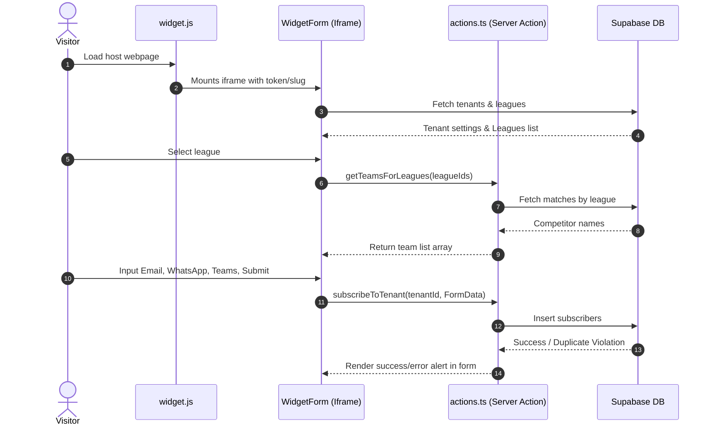
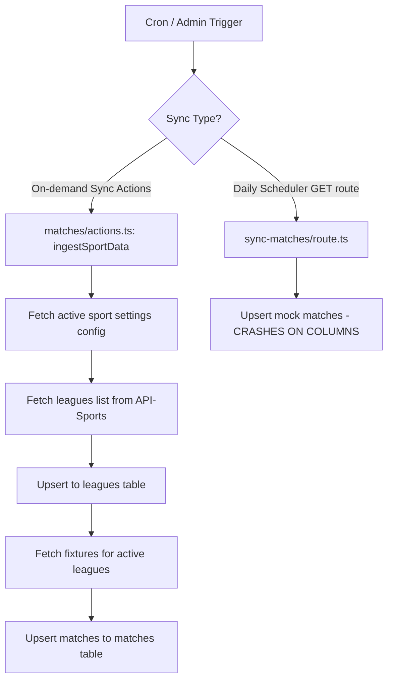
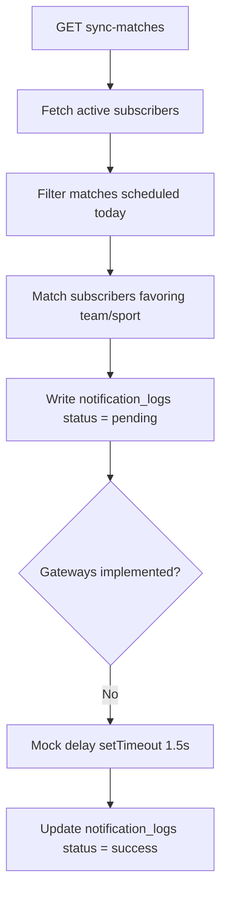
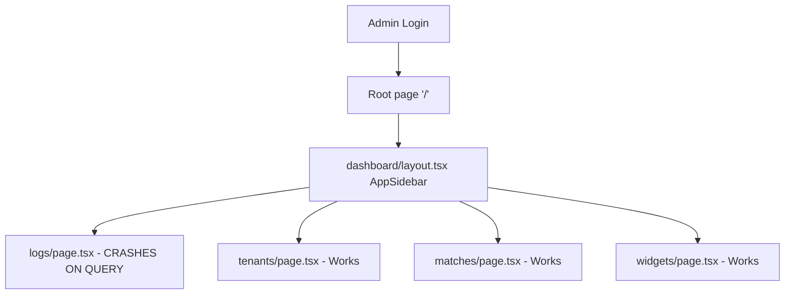

# SYSTEM_FLOW.md - System Flow & Execution Audit

This document traces the actual end-to-end execution flows and maps critical process breakpoints based on code evidence.

---

## 🔄 End-to-End System Flows

### 1. Embedded Widget Loading
* **Trigger:** Visitor opens a third-party website containing the widget script tag.
* **File involved:** [widget.js](file:///d:/WORK/WHELLO/NON-WORDPRESS/sports-reminder-module/public/widget.js)
* **Function involved:** `initWidgets()`
* **Database tables touched:** None
* **External APIs involved:** `/embed/verify?token=...` or `/embed/[tenant-slug]`
* **Current status:** **Working**

### 2. Widget Authentication & Setup
* **Trigger:** Iframe requests the target route.
* **File involved:** [page.tsx](file:///d:/WORK/WHELLO/NON-WORDPRESS/sports-reminder-module/app/embed/[tenant-slug]/page.tsx) or [page.tsx](file:///d:/WORK/WHELLO/NON-WORDPRESS/sports-reminder-module/app/embed/verify/page.tsx)
* **Function involved:** `EmbedWidgetPage` / `VerifyContent`
* **Database tables touched:** `tenants`, `leagues`
* **External APIs involved:** None
* **Current status:** **Working**

### 3. Dynamic Competitor Search
* **Trigger:** Subscriber selects a league in the form.
* **File involved:** [actions.ts](file:///d:/WORK/WHELLO/NON-WORDPRESS/sports-reminder-module/app/embed/[tenant-slug]/actions.ts)
* **Function involved:** `getTeamsForLeagues()`
* **Database tables touched:** `matches`
* **External APIs involved:** None
* **Current status:** **Working**

### 4. Subscription Registration Intake
* **Trigger:** Subscriber clicks the CTA submit button.
* **File involved:** [widget-form.tsx](file:///d:/WORK/WHELLO/NON-WORDPRESS/sports-reminder-module/app/embed/[tenant-slug]/widget-form.tsx) and [actions.ts](file:///d:/WORK/WHELLO/NON-WORDPRESS/sports-reminder-module/app/embed/[tenant-slug]/actions.ts)
* **Function involved:** `subscribeToTenant()`
* **Database tables touched:** `subscribers`
* **External APIs involved:** None
* **Current status:** **Working**

### 5. Daily Match Synchronization
* **Trigger:** Cron runner triggers matching sync GET request.
* **File involved:** [route.ts](file:///d:/WORK/WHELLO/NON-WORDPRESS/sports-reminder-module/app/api/cron/sync-matches/route.ts)
* **Function involved:** `GET()`
* **Database tables touched:** `matches` (upsert fails)
* **External APIs involved:** None
* **Current status:** **Broken** (Fails to execute due to columns mismatch)

### 6. Notification Dispatch Checks
* **Trigger:** Match sync router maps matches scheduled for H+1.
* **File involved:** [route.ts](file:///d:/WORK/WHELLO/NON-WORDPRESS/sports-reminder-module/app/api/cron/sync-matches/route.ts)
* **Function involved:** `GET()`
* **Database tables touched:** `subscribers` (read only)
* **External APIs involved:** None
* **Current status:** **Broken** (Dependent match creation above crashes)

### 7. Notification Logs Creation
* **Trigger:** Loop over target filtered subscriber arrays.
* **File involved:** [route.ts](file:///d:/WORK/WHELLO/NON-WORDPRESS/sports-reminder-module/app/api/cron/sync-matches/route.ts)
* **Function involved:** `GET()`
* **Database tables touched:** `notification_logs`
* **External APIs involved:** None
* **Current status:** **Broken** (Blocks on sync step)

### 8. Message Dispatch Gateways
* **Trigger:** Loop over queued notification items.
* **File involved:** N/A (Missing feature)
* **Function involved:** N/A
* **Database tables touched:** None
* **External APIs involved:** Meta WhatsApp API, Resend API
* **Current status:** **Missing** (Only simulated via 1.5s delay timer)

---

## 📊 Flow Diagrams

### A. Subscriber Registration Flow

### B. Match Synchronization Flow

### C. Notification Dispatch Flow

### D. Dashboard Management Flow

---

## 🚫 CRITICAL FLOW BREAKPOINTS

1. **Dashboard Security Breakpoint:** The dashboard authentication redirect checks do not run because Next.js ignores `proxy.ts`. Admin panels are publicly exposed.
2. **Matches Synchronization Breakpoint:** Triggering the cron API `/api/cron/sync-matches` halts immediately at the mock match insertion statement.
3. **Notification logs Dashboard Breakpoint:** Opening `/dashboard/logs` crashes the rendering tree due to bad query syntax.
4. **Logout Execution Breakpoint:** Clicking log out in the sidebar returns a 404 error page.
5. **Gateway Dispatch Breakpoint:** Notifications never leave the database; there are no active Meta or Resend handlers configured to receive the queue messages.
